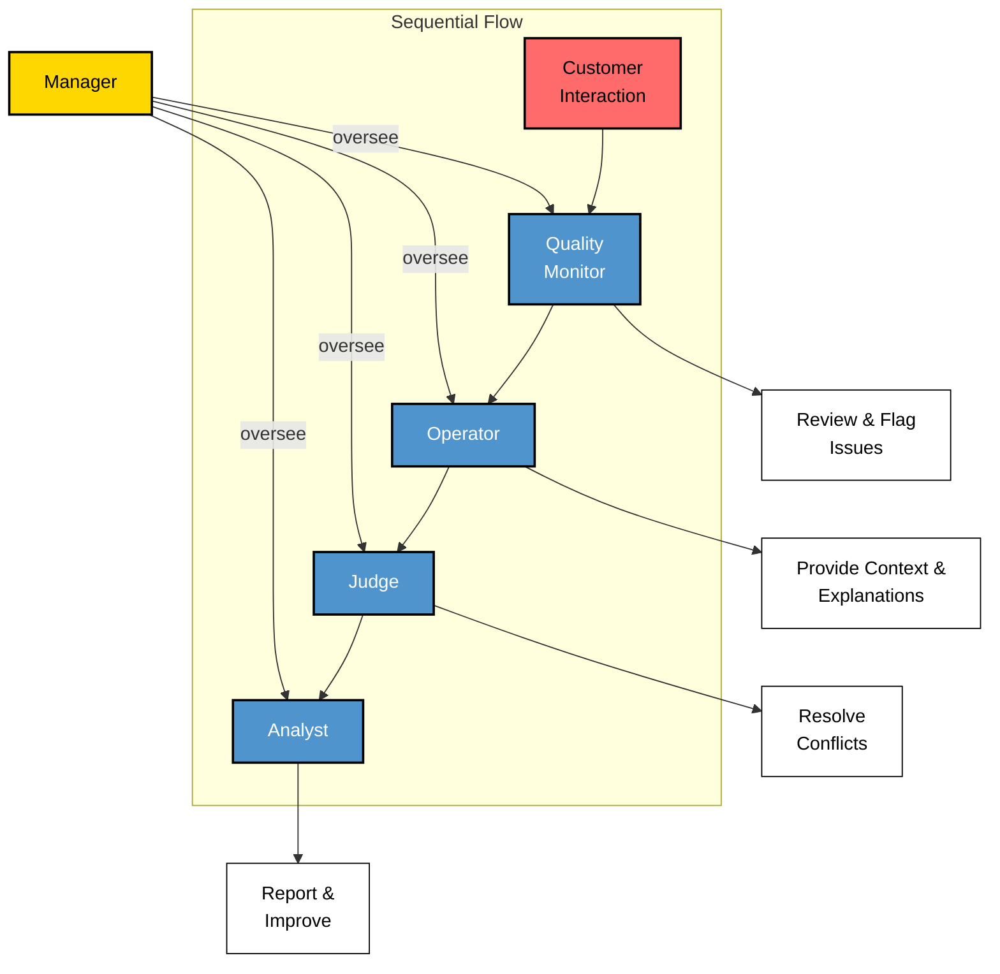

# How We Built a Better Way to Evaluate Customer Service: Our CrewAI Hackathon Project

During a recent hackathon, my team tackled a challenge that's been bugging me for years - how to effectively evaluate customer service at scale. Here's what we built and what I learned along the way.

## The Customer Service Quality Problem 

If you've ever managed a customer service team, you know the struggle. You want to maintain high-quality interactions, but your options are pretty limited. Most teams either randomly sample a few calls for manual review, rely on basic metrics like call time and resolution rate, or get so overwhelmed they give up on quality monitoring altogether.

I've been there - spending hours listening to call recordings, knowing I'm only seeing a tiny fraction of what's happening. There had to be a better way.

## Our Approach: Building a Virtual QA Team

We decided to experiment with CrewAI to build what's essentially a virtual quality assurance team. What's cool about CrewAI is that you can create different AI agents that each handle specific aspects of the review process, similar to how a human QA team works.

We structured our virtual team with five key roles:
* A Manager to oversee the process
* A Quality Monitor to review interactions
* An Operator to provide context and explanation
* A Judge to handle disagreements
* An Analyst to synthesize findings and suggest improvements



## How It Actually Works

The most interesting part of this project wasn't the technical implementation - it was figuring out how to mirror the back-and-forth of real quality assurance discussions. 

When a customer interaction comes in, our system kicks off a process that feels surprisingly human. The Monitor reviews the conversation first, but instead of just assigning a score, they can flag concerns or highlight good practices. The Operator can then explain the reasoning behind certain decisions or responses. If there's disagreement, our Judge steps in to mediate, much like a senior team lead would.

## What We Learned Building This

### 1. Keep Your Config Flexible

The best decision we made was moving all our agent definitions to YAML files. Makes tweaking the system way easier than digging through code:

```yaml
supervisor:
  role: >
    Customer Service Quality Supervision Manager
  goal: >
    Oversee the entire quality assessment process
```

### 2. Start with the Process, Not the Tech

We spent our first day just mapping out how good QA actually works in the real world. The tech should support good processes, not force people to work around it.

### 3. Specialized Roles Work Better

Having agents with focused responsibilities made everything more reliable. Kind of like how you'd rather have a team of specialists than one person trying to do everything.

## Where We Want to Take This

We've got some exciting ideas for where to take this next:

* Adding speech-to-text so we can analyze actual calls
* Letting teams input their own quality guidelines
* Creating personalized coaching recommendations
* Building better ways to track improvements over time

## Looking Forward

While this started as a hackathon project, I think we're onto something interesting. The goal isn't to replace human QA teams - it's to give them better tools to do their jobs well and focus on what matters most.

Want to check it out? The code's up on GitHub: [github.com/ibombonato/llm-agents-mooc/hackton](https://github.com/ibombonato/llm-agents-mooc-f24/tree/main/hackaton)


## Our team:

Icaro Bombonato - https://github.com/ibombonato

Gabriel Lins - https://github.com/gabrielblins

Claudiano Leonardo - https://github.com/ClaudianoLeonardo

---

*Note: This project was built during our team hackathon and is still in development. We'd love to hear your thoughts and feedback!*
